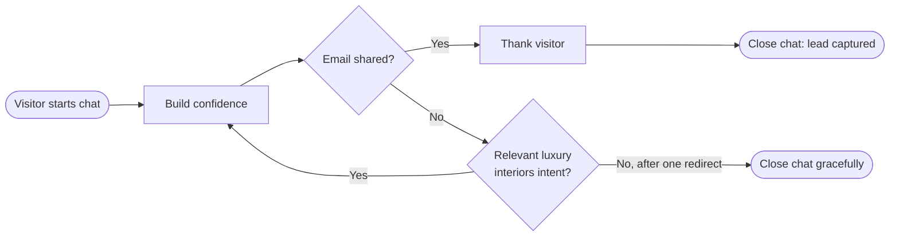

## Startup

### Docker Compose

Use Docker Compose for the full application stack, including Postgres:

```bash
cp .env.example .env
cp web/.env.example web/.env
```

Set `API_KEY` in `web/.env`, then start the app:

```bash
docker compose up --build
```

Open the app at http://localhost:3000.

### Local development

Start the database:

```bash
cp .env.example .env
docker compose up chat-db
```

In another terminal, install dependencies and run the web app:

```bash
cd web
cp .env.example .env
npm ci
npm run dev
```

Open the app at http://localhost:3000.

### Demo auth

The default demo login is:

- Username: `demo`
- Password: `demo`

Chat responses require `API_KEY` and `API_MODEL` in `web/.env`.

## MAIN APP IDEA

