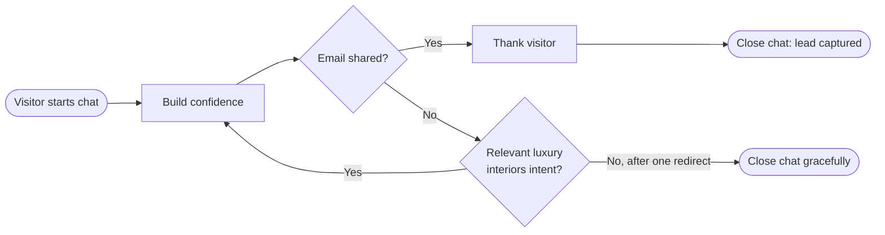

# Main App Idea

```mermaid
flowchart LR
  A([Visitor starts chat]) --> B[Build confidence]
  B --> C{Email shared?}
  C -- Yes --> D[Thank visitor]
  D --> E([Close chat: lead captured])
  C -- No --> F{"Relevant luxury<br/>interiors intent?"}
  F -- Yes --> B
  F -- No, after one redirect --> G([Close chat gracefully])
```
