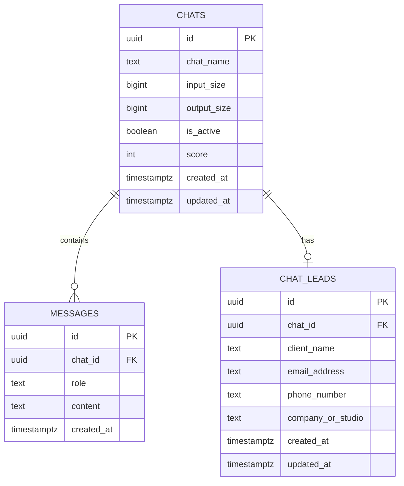

Chat State:

- `input_size` is the cumulative provider-reported `usage.prompt_tokens` spent for the chat.
- `output_size` is the cumulative provider-reported `usage.completion_tokens` spent for the chat.
- Chat cost estimates use the current `API_MODEL` with `web/lib/pricing.ts`; cached input pricing is not used because cached token counts are not stored.
- `is_active` defaults to `true`. When `false`, the chat cannot accept new messages.
- `updated_at` changes when messages, token usage, or lead details update the chat.

Score Logic:

```JS
function scoreChat(data) {
    let score = 0;

    if (isValidEmail(data.email_address)) score += 40;
    if (data.client_name) score += 25;
    if (data.phone_number) score += 20;
    if (data.company_or_studio) score += 15;

    return Math.min(score, 100);
}
```
